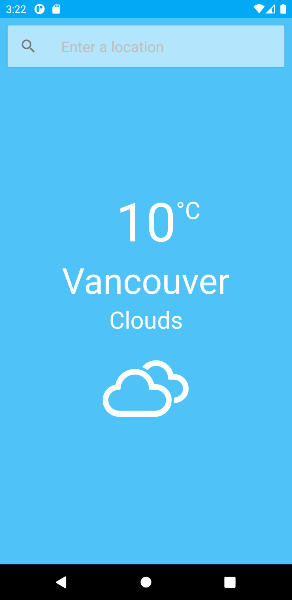

# Android Weather App

## About
A weather app for Android. When the app is opened it displays the weather in the current location of the user. Users can also search for the weather in different places around the world. Weather data is fetched from the [OpenWeatherMap API](https://openweathermap.org/api). 

## Screenshot

